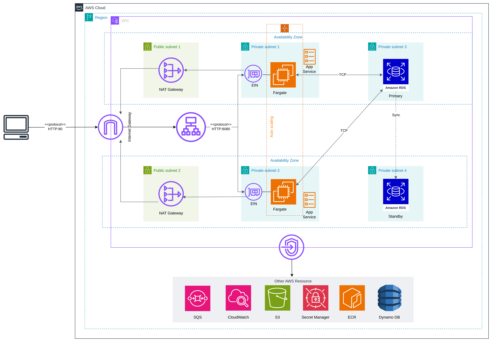

# Description

This project serves the purpose of deploying a Spring Boot application using AWS CDK (Cloud Development Kit) for
Infrastructure as Code (IaC) following best practice AWS architecture n-tier.

What this project offers is hands-on knowledge about getting a Spring Boot application into the cloud and operating it
there. I built a continuous deployment pipeline, accessed the most common AWS services from a Spring Boot app, and
learned how to monitor and nurture the app once it’s live.

The Spring Boot application used for deploying is at this [repo](https://github.com/Bistro-Cheese/cheese-bistro-server)
# Table Content
* [Introduction](#introduction)
  * [Architecture Overview](#architecture-overview)
  * [Pre-requisites](#pre-requisites)
  * [AWS Services](#aws-services)
* [Getting Started](#getting-started)
* [Usage](#usage)
* [Checklist](#checklist)
* [Contributing](#contributing)
* [Reference & Inspiration](#reference--inspiration)

# Introduction

In this project, we leverage AWS CDK to provision and manage AWS resources needed to deploy a Spring Boot application.
The primary goal is to demonstrate how to use AWS services in a structured and automated manner, ensuring scalability,
reliability, and maintainability.


## Architecture Overview

This project follows an n-tier architecture which includes:

- **Presentation Tier**: This layer is the endpoint for requests from clients.
- **Application Tier**: Amazon ECS (Elastic Container Service) for running the Spring Boot application in Docker
  containers.
- **Data Tier**: Amazon RDS (Relational Database Service) for database management.
- **Networking**: Amazon VPC (Virtual Private Cloud) for networking and security.
  

## Pre-requisites

- AWS CLI
  - You must configure security credentials for the CDK CLI, refer to this [link](https://docs.aws.amazon.com/cdk/v2/guide/configure-access.html)
- Node.js (for AWS CDK)
- AWS CDK Toolkit
- Docker
- Java 11 or higher
- Maven

## AWS Services

This is all AWS services will be leveraged in this project. For more detail, I recommend reading them on AWS Official
Document

| Service                                  | Description                                                                                                                                                                                        | Status |
|------------------------------------------|----------------------------------------------------------------------------------------------------------------------------------------------------------------------------------------------------|--------|
| AWS Cloudformation                       | A service for modeling and setting up AWS resources using infrastructure as code.                                                                                                                  | ✔️     |
| AWS Cloud Development Kit (CDK)          | A software development framework for defining cloud infrastructure in code and provisioning it through AWS CloudFormation.                                                                         | ✔️     |
| AWS CloudWatch                           | A monitoring and management service providing data and actionable insights for AWS, hybrid, and on-premises applications and infrastructure resources.                                             | ✔️     |
| AWS Cognito                              | A service to add user sign-up, sign-in, and access control to web and mobile apps.                                                                                                                 | 🚧     |
| AWS DynamoDB                             | A fully managed NoSQL database service that provides fast and predictable performance with seamless scalability.                                                                                   | 🚧     |
| AWS Elastic Compute Cloud (EC2)          | A web service that provides resizable compute capacity in the cloud                                                                                                                                | ✔️     |
| AWS Elastic Container Registry (ECR)     | A fully managed Docker container registry that makes it easy for developers to store, manage, and deploy Docker container images.                                                                  | ✔️     |
| AWS Elastic Container Service (ECS)      | A fully managed container orchestration service that makes it easy to run, stop, and manage Docker containers on a cluster.                                                                        | ✔️     |
| Amazon MQ                                | A managed message broker service for Apache ActiveMQ and RabbitMQ that makes it easy to set up and operate message brokers in the cloud.                                                           | ❌      |
| Amazon Relational Database Service (RDS) | A managed relational database service that provides six familiar database engines to choose from, including Amazon Aurora, PostgreSQL, MySQL, MariaDB, Oracle, and Microsoft SQL Server.           | ✔️     |
| Amazon Route 53                          | A scalable and highly available Domain Name System (DNS) web service.                                                                                                                              | 🚧     |
| AWS Elastic Compute Cloud (EC2)          | A web service that provides resizable compute capacity in the cloud                                                                                                                                | ✔️     |
| Amazon Simple Email Service (SES)        | A cost-effective, flexible, and scalable email service that enables developers to send mail from within any application.                                                                           | 🚧     |
| AWS Elastic Compute Cloud (EC2)          | A web service that provides resizable compute capacity in the cloud                                                                                                                                | ✔️     |
| Amazon Simple Queue Service (SQS)        | A fully managed message queuing service that enables you to decouple and scale microservices, distributed systems, and serverless applications.                                                    | ✔️     |
| Amazon Simple Storage Service (S3)       | An object storage service that offers industry-leading scalability, data availability, security, and performance.                                                                                  | ✔️     |
| Amazon Virtual Private Cloud (VPC)       | A service that lets you launch AWS resources in a logically isolated virtual network that you define.                                                                                              | ✔️     |
| AWS Certificate Manager                  | A service that lets you easily provision, manage, and deploy public and private SSL/TLS certificates for use with AWS services and your internal connected resources.                              | ✔️     |
| AWS Identity and Access Management (IAM) | A web service that helps you securely control access to AWS services and resources for your users.                                                                                                 | ✔️     |
| AWS Lambda                               | A serverless compute service that lets you run code without provisioning or managing servers, creating workload-aware cluster scaling logic, maintaining event integrations, or managing runtimes. | 🚧     |
| AWS Secrets Manager                      | A service to help you protect access to your applications, services, and IT resources without the upfront cost and complexity of managing hardware security modules (HSMs).                        | ✔️     |
| AWS Systems Manager (SSM)                | A service that provides a unified user interface so you can view operational data from multiple AWS services and automate operational tasks across your AWS resources.                             | ✔️     |
| Elastic Load Balancing (ELB)             | Automatically distributes incoming application traffic across multiple targets, such as Amazon EC2 instances, containers, and IP addresses, in one or more Availability Zones.                     | ✔️     |


# Getting Started
- For setting up AWS CDK, please refer to this [AWS Document](https://docs.aws.amazon.com/cdk/v2/guide/getting_started.html)
- Make sure that you follow step by step to install all essential tools, packages, and configuration. Let's go to the usage.
# Usage
Because I have not built CI/CD for this project so if you want to deploy services, you must deploy each one.
Variable Meaning:
- `--profile bistroadmin`: AWS CLI profile to use.
- `--app "mvn -e -q compile exec:java -Dexec.mainClass=com.myorg.<JAVA_CLASS>"`: Command to compile and execute the CDK app.
- `-c region=<your_region>`: AWS region for deployment.
- `-c applicationName=<your_app_name>`: Name of the application.
- `-c springProfile=<spring_profile>`: Spring Boot profile to use.
- `-c environmentName=<your_environment>`: Deployment environment name.
- `-c dockerRepositoryName=<ecr_repo>`: Name of the Docker repository.
- `-c dockerImageTag=<img_tag>`: Tag for the Docker image.

In the source, you must come to the directory `src/main/java/com/myorg/constant/AWSParameter.java`, then replacing `ACCOUNT_ID` with your AWS account id.

Now opening your cmd at where the directory contains CDK source code and executing respectively below command.

**Network Service**:
```sh
cdk deploy --app "mvn -e -q compile exec:java -Dexec.mainClass=com.myorg.NetworkApp" --profile <your_profile> -c region=<your_region> -c environmentName=<your_environment>
```
**Docker Repository**:
```sh
cdk deploy --app "mvn -e -q compile exec:java -Dexec.mainClass=com.myorg.DockerRepositoryApp" --profile <your_profile> -c region=<your_region> -c environmentName=<your_environment>
```
**Database - RDS**:
```sh
cdk deploy --app "mvn -e -q compile exec:java -Dexec.mainClass=com.myorg.DatabaseApp" --profile <your_profile> -c region=<your_region> -c environmentName=<your_environment>
```
**Queue**:

```sh
cdk deploy --app "mvn -e -q compile exec:java -Dexec.mainClass=com.myorg.MessagingApp" --profile <your_profile> -c region=<your_region> -c environmentName=<your_environment>
```

**Your Service**:
```sh
cdk deploy --profile bistroadmin --app "mvn -e -q compile exec:java -Dexec.mainClass=com.myorg.ServiceApp"  --profile <your_profile> -c region=<your_region> -c applicationName=<your_app_name> -c springProfile=<spring_profile> -c environmentName=<your_environment> -c dockerRepositoryName=<ecr_repo> -c dockerImageTag=<img_tag> --all
```
# Checklist

- [x] Deploying Network Infrastructure + Application Load Balancer
- [x] Deploying Docker Repository
- [x] Deploying RDS that is used for database of application
- [x] Deploying DynamoDB for tracing User Action
- [x] Deploying Message Queue for Sending Notification Feature
- [x] Deploying application by leveraging ECS Fargate 
- [ ] Deploying Simple Email Service
- [ ] Configuring HTTPS and a Custom Domain with Route 53 and ELB
- [x] Deploy AWS CloudWatch to collect metrics from application
- [ ] Alerting with Amazon CloudWatch
- [ ] Build CI/CD for this CDK project to remove many steps deploying services


# Contributing
Contributions are welcome! Please submit a pull request or open an issue to discuss what you would like to change.

# Reference & Inspiration
- AWS Official Document: https://docs.aws.amazon.com/
- Great Project: https://stratospheric.dev/
- AWS Study Group: https://www.facebook.com/groups/660548818043427/?hoisted_section_header_type=recently_seen&multi_permalinks=1636629737101992
- AWS FCJ Bootcamp